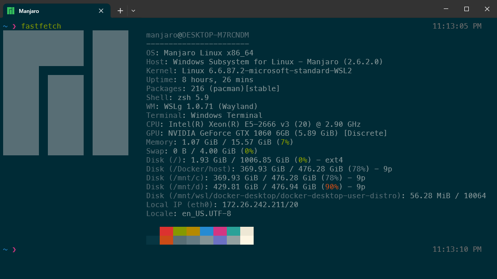

# Manjaro WSL Builder
Automated pipeline to generate a custom Manjaro Linux distribution for Windows Subsystem for Linux (WSL2) using Docker.

[](https://github.com/lucas-de-lima/manjaro-wsl/releases)
[](https://github.com/lucas-de-lima/manjaro-wsl/releases/latest)
[](http://makeapullrequest.com)
[](https://github.com/lucas-de-lima/manjaro-wsl/blob/main/LICENSE)

<p align="center">
  
</p>


## Requirements

* WSL2 enabled
* Docker Desktop installed and running

## Build Process

1. Clone this repository
2. Open your terminal in the project root directory
3. Run the build script:

   ```
   ./build.sh
   ```

After completion, the artifacts will be available in the `output/` directory:

* `Manjaro.exe` (Launcher)
* `rootfs.tar.gz` (Root filesystem image)

## Installation

1. Create a permanent directory for the distribution (e.g., `C:\ManjaroWSL`)
2. Move the generated files from `output/` to this directory
3. Run `Manjaro.exe` to register the distribution in WSL
4. Validate the installation:

   ```
   wsl -d Manjaro
   ```

## System Specifications

* Base image: `manjarolinux/base:latest`
* Default user: `manjaro`
* Passwordless sudo enabled for the default user
* Pre-configured Zsh environment

## Credits

This project uses the launcher from the [wsldl](https://github.com/yuk7/wsldl) project by yuk7.

## Post Installation

Want to turn this basic installation into a robust development machine (Zsh plugins, ASDF, Powerlevel10k)?

Check out our complete guide: [Post-Installation Guide](./docs/Post-Installation.md)