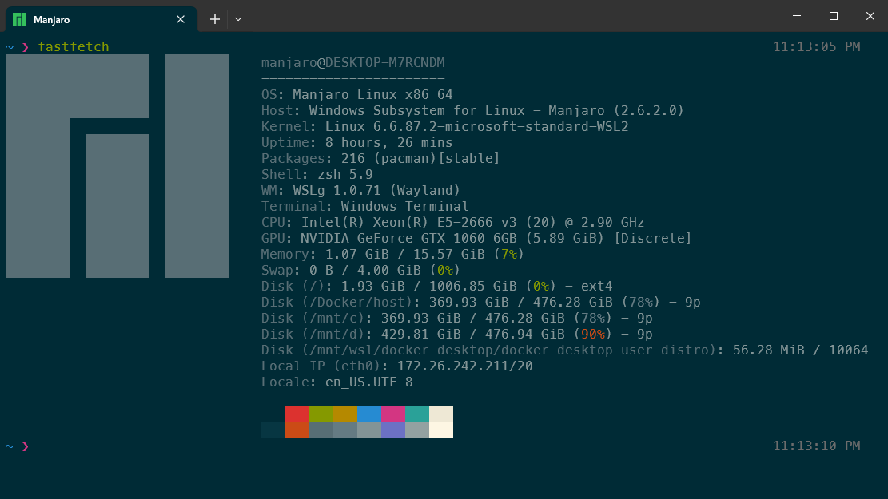

# Manjaro WSL Builder

Automated pipeline to generate a custom Manjaro Linux root filesystem for Windows Subsystem for Linux (WSL2) using Docker. The result is installable via the official `wsl --import` command.

[](https://github.com/lucas-de-lima/manjaro-wsl/releases)
[](https://github.com/lucas-de-lima/manjaro-wsl/releases/latest)
[](http://makeapullrequest.com)
[](https://github.com/lucas-de-lima/manjaro-wsl/blob/main/LICENSE)

<p align="center">
  
</p>

## Requirements

- **To use a pre-built rootfs:** WSL2 enabled on Windows.
- **To build from source:** WSL2, Docker (e.g. Docker Desktop) installed and running.

## Build Process

From the project root:

1. Build the Docker image:
   ```bash
   docker build -t manjaro-wsl -f docker/Dockerfile .
   ```

2. Create a container from the image:
   ```bash
   docker create --name manjaro manjaro-wsl
   ```

3. Export the root filesystem:
   ```bash
   docker export manjaro | gzip > rootfs.tar.gz
   docker rm manjaro
   ```

Alternatively, run the build script (it performs these steps and outputs `rootfs.tar.gz` in `output/`):

```bash
./scripts/build.sh
```

Artifacts will be in the `output/` directory: **rootfs.tar.gz** (root filesystem image).

## Installation

1. **Get the rootfs**  
   Download a release and extract `rootfs.tar.gz`, or use the file from your local `output/` after building.

2. **Import into WSL (PowerShell)**  
   ```powershell
   wsl --import Manjaro C:\WSL\Manjaro C:\path\to\rootfs.tar.gz --version 2
   ```  
   Use the real path to your `rootfs.tar.gz`. The `--version 2` option is required for WSL2.

3. **Start the distro**  
   ```powershell
   wsl -d Manjaro
   ```

4. **Verify systemd**  
   Inside the distro:
   ```bash
   ps -p 1 -o comm=
   ```  
   Expected output: `systemd`.

### Troubleshooting — VS Code Remote not connecting

If the Manjaro distro does not show up or connect in VS Code Remote - WSL, it may have been registered with the wrong backend. Re-register with WSL2:

```powershell
wsl --unregister Manjaro
wsl --import Manjaro C:\WSL\Manjaro C:\path\to\rootfs.tar.gz --version 2
```

Then start the distro again with `wsl -d Manjaro`.

## System Specifications

- Base image: `manjarolinux/base:latest`
- Default user: `manjaro`
- Passwordless sudo enabled for the default user
- Pre-configured Zsh environment

## Why this project does not use a custom launcher

This project does **not** ship or rely on a custom installer/launcher (e.g. an `.exe`). Installation is done with the official WSL command:

- **`wsl --import`** is the supported way to register a distribution in WSL.
- It avoids dependency on internal WSL APIs and reduces compatibility issues (e.g. wrong mount backend, VS Code Remote not working).
- It keeps the project simple and predictable: we only produce a rootfs; Windows/WSL handle installation.

## Post Installation

Want to turn this basic installation into a robust development machine (Zsh plugins, ASDF, Powerlevel10k)?

See the [Post-Installation Guide](./docs/Post-Installation.md).
